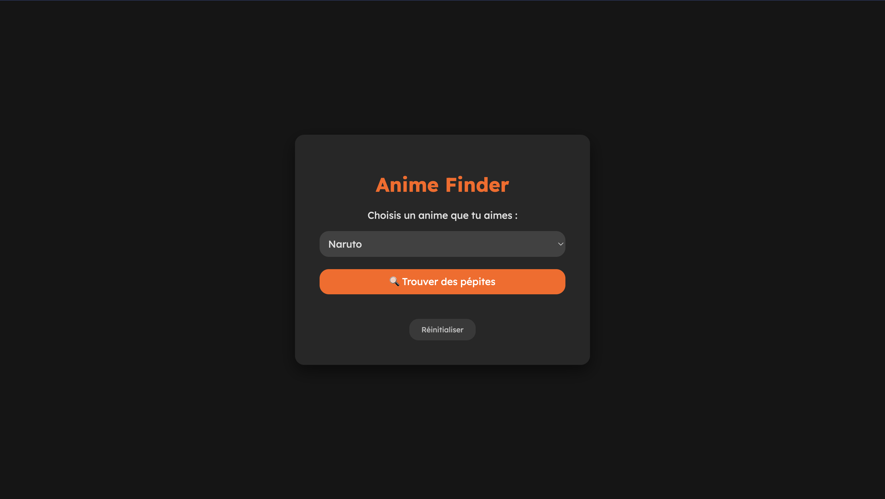

# 🎌 Projet : Score Éditorial Anime

[](https://projet-anime-data.vercel.app/)
[](assets/Synthèse_du_Projet_Score_Éditorial_Anime.pptx)

"Comment identifier les pépites d'un catalogue sans tout regarder ?"

## ⚙️ Installation et Configuration

Pour lancer ce projet localement, suivez ces étapes :

1. **Cloner le projet** :
   ```bash
   git clone [https://github.com/ton-pseudo/ton-projet.git](https://github.com/ton-pseudo/ton-projet.git)
   cd ton-projet
2. **Installer les dépendances : Assurez-vous d'avoir Python installé, puis lancez :**
   ```bash
   pip install -r requirements.txt
3. **Lancer l'analyse : Ouvrez le notebook dans VS Code ou via Jupyter Lab :**
   ```bash
   jupyter notebook notebooks/main_analysis.ipynb
---

### Explication des imports (Pour ton rapport ou ta culture)

Si tu dois expliquer dans ton notebook ou ton rapport **pourquoi** tu utilises ces lignes précises, voici le mémo technique :

| Bibliothèque | Alias Classique | Rôle dans ton projet |
| :--- | :--- | :--- |
| **Pandas** | `import pandas as pd` | C'est le cœur du projet. Il sert à manipuler le tableau de données (Dataframe), nettoyer les colonnes et calculer le Score. L'alias `pd` est une convention universelle. |
| **NumPy** | `import numpy as np` | Sert aux calculs mathématiques rapides. Pandas repose dessus. (Utilisé indirectement pour la gestion des nombres). |
| **Matplotlib** | `import matplotlib.pyplot as plt` | La base de la visualisation. On l'utilise pour définir la taille des graphiques (`figsize`) et ajouter des titres/labels. |
| **Seaborn** | `import seaborn as sns` | Une surcouche esthétique à Matplotlib. Elle permet de faire les scatterplots colorés et les histogrammes complexes en une ligne de code. |
| **Plotly** | `import plotly.express as px` | Utilisé pour le bonus (Treemap). Permet de créer des graphiques **interactifs** (zoom, clic, survol). |
| **OS** | `import os` | (Bibliothèque standard, pas d'installation). Permet de gérer les chemins de fichiers pour que ton notebook trouve les données, qu'il soit sur Mac ou PC. |

Est-ce que cela complète bien ton dossier ? Si tu as créé le fichier `requirements.txt` et mis à jour le README, tu es officiellement prêt à publier ! 🚀

## 🎯 Problématique Métier
Une plateforme de streaming souhaite mettre en avant des animes de qualité pour fidéliser ses abonnés.

Le problème : Se baser uniquement sur la "Note Moyenne" (IMDb/MAL) est risqué. Un anime noté 8/10 peut être excellent tout du long, ou très inégal (épisodes géniaux mélangés à des épisodes médiocres).

La solution : Créer un Score Éditorial qui pondère la qualité globale par la régularité.

Objectif : Fournir un outil d'aide à la décision pour les curateurs (humains) de la plateforme.

## 📊 Hypothèses de Travail
H1 : La moyenne ment. Deux animes avec la même note globale (ex: 8.5) n'ont pas la même valeur. Celui qui est stable est "plus sûr" que celui qui fait le yoyo.

H2 : La régularité est un gage de qualité. Un faible écart entre le meilleur et le pire épisode indique une maîtrise de la production.

H3 : Un score composite est nécessaire. Il faut mélanger la popularité (Note Globale) et la fiabilité (Régularité).

## 🛠️ Méthodologie & Étapes du Projet
### 1. Nettoyage & Exploration (Data Cleaning)
Quoi : Correction des dates, gestion des valeurs manquantes, suppression des doublons et anomalies (ex: notes impossibles).

Pourquoi : Des données sales faussent les calculs. On ne peut pas calculer un score fiable sur des doublons ou des erreurs de saisie.

### 2. Feature Engineering (Construction du Score)
Nous avons créé de nouvelles variables pour mesurer la stabilité :

Ecart = Note_Meilleur_Ep - Note_Pire_Ep (Plus c'est grand, plus c'est risqué).

Score_Regularite = 10 - Ecart (Note sur 10 de la stabilité).

Score_Editorial = (0.6 * Note_Globale) + (0.4 * Score_Regularite).

Choix de pondération : On privilégie la qualité intrinsèque (60%) tout en pénalisant fortement l'irrégularité (40%).

### 3. Validation Statistique
Quoi : Comparaison graphique (Scatter Plot) entre la Note Globale et le Score Éditorial.

Résultat : Les animes "instables" (ex: Naruto, Black Clover) tombent dans le classement, tandis que les œuvres maîtrisées (Frieren, Vinland Saga) restent au sommet. L'hypothèse est validée.

### 4. Segmentation Métier
Pour aider la décision, nous avons classé les animes en 4 catégories claires :

💎 Chef-d'œuvre (Score ≥ 8.5)

✅ Très bon (Score 8.0 - 8.5)

⚠️ Bon mais risqué (Score 7.0 - 8.0)

❌ À éviter (Score < 7.0)

### 5. Moteur de Recommandation
Fonctionnement : Un système de filtrage qui suggère des animes du même genre, mais uniquement s'ils ont un Score Éditorial élevé.

Exemple : Si un utilisateur aime One Piece, on ne lui recommande pas juste un autre anime de pirates, mais un anime d'aventure fiable et régulier.

### 6. 📱 Application de Recommandation (Streamlit)

Pour rendre ce projet utilisable par des humains (et pas seulement des Data Scientists), j'ai développé une **Web App interactive** avec la librairie `Streamlit`.

Cette interface permet de :
* 🔎 **Explorer** le catalogue en filtrant par genre.
* 📊 **Visualiser** graphiquement la différence entre Note Globale et Score Éditorial.
* 🤖 **Tester le moteur de recommandation** en temps réel.

**Lien de l'app : https://projet-anime-data.streamlit.app/**

> **Comment lancer l'app localement ?**
> ```bash
> streamlit run app.py
> ```

## 🚀 Architecture Fullstack & Déploiement

Pour rendre ce projet accessible au grand public, j'ai développé une **Web App interactive** séparant la logique métier (Python) de l'interface utilisateur.

**Aperçu de l'interface :**



**🔗 Tester l'application :** [https://projet-anime-data.vercel.app/](https://projet-anime-data.vercel.app/)

### 🛠️ Stack Technique
* **Backend (Le Cerveau) :** API développée avec **FastAPI** (Python). Elle héberge l'algorithme de recommandation et traite les données. Déployée sur **Render**.
* **Frontend (Le Visage) :** Interface responsive en **HTML/CSS/JS** pur. Elle interroge l'API pour afficher les résultats dynamiquement. Déployée sur **Vercel**.

**Fonctionnalités :**
* 🔎 Recherche d'animes et filtrage par genre.
* 📊 Affichage du Score Éditorial vs Note Globale.
* 🤖 Recommandations "Safe" basées sur la régularité.

> *Note : L'API étant hébergée sur une instance gratuite (Render), le premier chargement peut prendre ~50 secondes (Cold Start).*

## 📊 Support de Présentation

J'ai synthétisé la démarche, la méthodologie et les résultats clés dans une présentation détaillée.

<a href="assets/Synthèse_du_Projet_Score_Éditorial_Anime.pptx">
  
</a>


📥 **[Télécharger la présentation complète (.pptx)](assets/Synthèse_du_Projet_Score_Éditorial_Anime.pptx)**

## 🚀 Résultats & Conclusion
Ce projet prouve qu'avec des données limitées (Notes Min/Max/Moyenne), on peut affiner considérablement la sélection éditoriale.

**Top 3 Fiables** : Frieren, Vinland Saga, Fullmetal Alchemist: Brotherhood.

**Piège évité** : Les longues séries (Shonen fleuves) sont souvent surcotées par leur moyenne globale mais sanctionnées par notre score de régularité.


*Projet réalisé dans le cadre du module Python pour la Data Science.*
